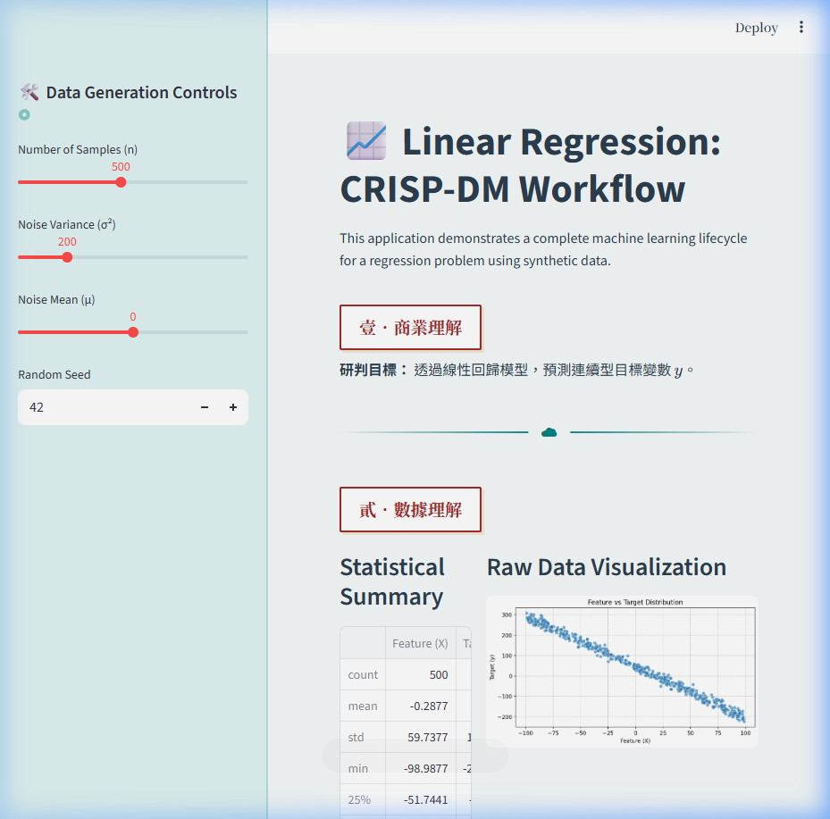

# 📈 數據科學之卷：線性回歸 CRISP-DM 實踐

### 🔗 [點此進入 Live Demo](https://0428dic7-mbk7fsxktrjcvzmjvenhhh.streamlit.app/)

## 🖼️ 介面預覽 (Preview)


這是一個基於 **Streamlit** 開發的互動式 Web 應用程式，旨在透過線性回歸（Linear Regression）模型，完整演示數據探勘標準流程 **CRISP-DM** 的六大階段。

## 🎨 視覺設計：清雅藍綠古風
本專案採用了獨特的**「清雅藍綠古風」**設計，將現代數據科學與傳統美學結合：
- **色調**：以「靛青」與「碧玉」為核心配色，搭配淡雅的背景。
- **元素**：使用傳統大寫中文序數（壹、貳...）、硃砂印章標題、以及祥雲圖案的分隔線。
- **佈局**：模擬古典卷軸的排版，提供沉浸式的視覺體驗。

---

## 🛠️ 功能核心
1. **互動式數據生成**：
   - 可自定義樣本數 ($n$)、雜訊變異數 ($\sigma^2$) 與隨機種子。
   - 自動生成符合 $y = ax + b + \text{noise}$ 規律的合成數據。
2. **CRISP-DM 流程演示**：
   - **壹．商業理解**：確立預測目標。
   - **貳．數據理解**：即時數據分佈視覺化（Scatter Plot）。
   - **參．數據準備**：訓練/測試集分割與數據標準化（StandardScaler）。
   - **肆．模型建立**：執行線性回歸訓練，並對比真實參數與學習參數。
   - **伍．評估驗證**：展示 MSE、RMSE、R² 分數，並繪製擬合結果圖。
   - **陸．部署應用**：提供即時推演介面與模型封存（joblib）下載功能。

---

## 🚀 快速啟動

### 1. 安裝依賴套件
請確保你的環境中已安裝以下 Python 庫：
```bash
pip install streamlit pandas numpy scikit-learn matplotlib seaborn joblib
```

### 2. 執行應用程式
在終端機中執行：
```bash
python -m streamlit run app.py
```

---

## 📚 技術棧
- **Frontend**: Streamlit (with Custom CSS)
- **Data Handling**: Pandas, Numpy
- **Machine Learning**: Scikit-Learn
- **Visualization**: Matplotlib, Seaborn
- **Persistence**: Joblib

---
*「數據如水，模型如杯；順勢而為，方見規律。」*
